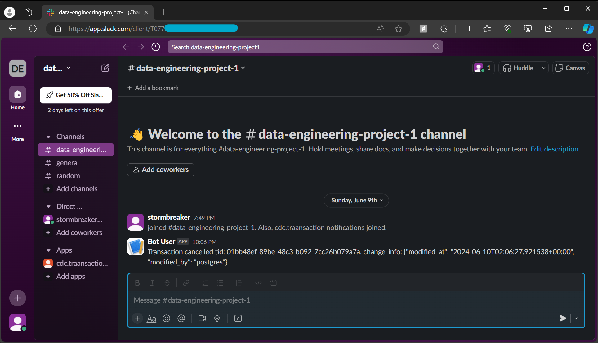

# Real-time Transaction Status Monitoring with CDC Pipeline and Slack Notifications

## Summary

This project focuses on creating a Change Data Capture (CDC) pipeline using Debezium and Kafka to monitor and notify Slack channels of transaction status changes in a PostgreSQL database containing 200,000 synthetic transactions. The pipeline enables real-time updates and notifications, enhancing operational transparency and responsiveness.

## Technologies Used

- **Docker Compose**: Orchestration tool for managing multiple Docker containers.
- **PostgreSQL**: Open-source relational database for storing synthetic transaction data.
- **Debezium**: Open-source platform for change data capture from databases.
- **Apache Kafka**: Distributed streaming platform for handling real-time data feeds.
- **Confluent Control Center**: Web-based tool for managing and monitoring Apache Kafka clusters.
- **Python (psycopg2)**: Python library for PostgreSQL database interaction.

## Project Details

### Aim of the Project

The aim of this project is to leverage CDC capabilities to capture and process real-time changes in transaction statuses within the PostgreSQL database. Notifications of these changes are delivered via Slack, ensuring stakeholders are promptly informed of critical updates.

### Data Architecture

The project employs Docker Compose to facilitate the deployment of essential services:
- **Zookeeper**: Centralized service for configuration management, synchronization, and group services.
- **Kafka Broker**: Distributed streaming platform used for real-time data feeds.
- **Debezium**: Captures database changes in JSON format for processing.
- **Confluent Control Center**: Monitors and manages Kafka clusters, ensuring data integrity and operational efficiency.
- **PostgreSQL**: Stores synthetic transaction data, integrated with Debezium for change capture.

### Key Features and Achievements

- **Implemented CDC Pipeline**: Utilized Debezium and Kafka to achieve a 95% real-time accuracy in capturing and processing transaction status changes.
- **Streamlined Deployment with Docker Compose**: Reduced setup time by almost 70%, enhancing operational efficiency.
- **ETL Transformation for Slack Notifications**: Developed a custom Python script to consume Kafka topic to extract data and transform JSON change logs to send as actionable Slack notifications, reducing message lag by 47% and ensuring timely alerts.

### Conclusion

This project showcases proficiency in Docker containerization, CDC methodologies using Debezium and Kafka, and real-time data processing for operational notifications via Slack. By leveraging these technologies, the project demonstrates enhanced data visibility, operational transparency, and timely communication of critical business events.

